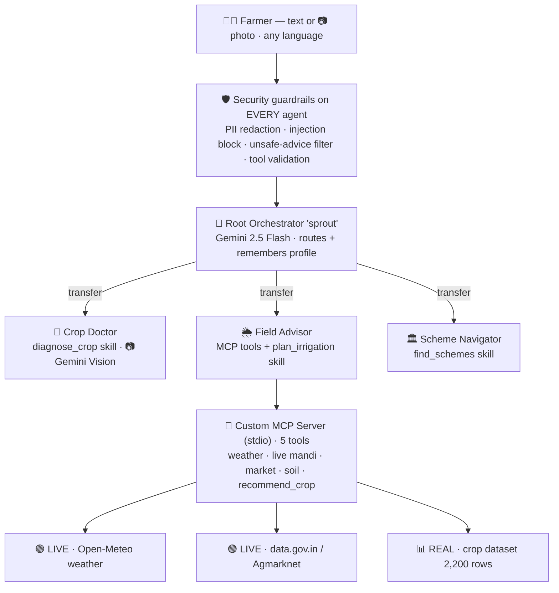

# 🌱 Sprout — AI Farming Co-pilot for Smallholder Farmers

> **Kaggle "AI Agents: Intensive Vibe Coding" Capstone — Track: Agents for Good**

Sprout is a **multi-agent system** that puts an agronomist, a market analyst, and a
government-scheme advisor in every smallholder farmer's pocket — in plain language,
on free infrastructure. A farmer can ask *"my tomato leaves have brown spots,"*
*"what should I grow in my soil,"* *"what's the cotton price,"* or *"is there a loan
scheme for seeds?"* and Sprout routes the question to the right specialist.

It is built on **Google's Agent Development Kit (ADK)** and demonstrates **five** of
the course's key concepts (only three are required):

| # | Concept | Where it lives |
|---|---------|----------------|
| 1 | **Multi-agent system (ADK)** | `sprout/agent.py` (root) + `sprout/sub_agents/` (3 specialists) |
| 2 | **Custom MCP server** | `sprout/mcp_server/server.py` — live weather, **live mandi prices**, soil, real-data crop tools over stdio |
| 3 | **Agent skills** | `sprout/skills/` — declarative, reusable capability modules |
| 4 | **Security features** | `sprout/security/` — PII redaction, prompt-injection block, unsafe-advice filter, tool validation |
| 5 | **Evaluation** | `eval/` — ADK eval suite (routing + MCP tool-trajectory scoring) |

**Plus bonus capabilities:**
- 📷 **Multimodal** — send a *photo* of a sick plant; `crop_doctor` (Gemini Vision) identifies the disease, then uses the `diagnose_crop` skill for remedies (`demo/image_demo.py`).
- 🧠 **Memory** — remembers the farmer's location/soil/crops across turns via ADK **session state** (`sprout/skills/farmer_profile.py`).
- 🌐 **Multilingual** — replies in the farmer's own language (Hindi, Marathi, Tamil, …).

💸 **100% free to run:** Google ADK (open source) + Gemini free tier + the free
[Open-Meteo](https://open-meteo.com) weather API (no key) + a **real, vendored
[Crop Recommendation dataset](https://www.kaggle.com/datasets/madhuraatmarambhagat/crop-recommendation-dataset)**
(2,200 records, 22 crops) powering data-driven crop advice.

---

## Architecture

**4 agents total:** 1 root orchestrator + 3 specialists. Security wraps every agent;
the Field Advisor talks to a custom MCP server backed by live + real data.



> 🖼️ A polished, screenshot-ready version for slides/video is in
> [`docs/architecture.html`](docs/architecture.html) — open it in a browser.

<details><summary>Plain-text version</summary>

```
                        👩‍🌾 Farmer
                           │
              ┌────────────▼─────────────┐
              │  SECURITY GUARDRAILS      │  before_model: redact PII, block injection
              │  (ADK callbacks on every  │  after_model:  block unsafe advice, add safety note
              │   agent)                  │  before_tool:  validate arguments
              └────────────┬─────────────┘
                           │
                  ┌────────▼─────────┐
                  │   root_agent     │  orchestrator: understands & delegates
                  │   "Sprout"       │
                  └───┬─────┬─────┬──┘
          ┌───────────┘     │     └────────────┐
          ▼                 ▼                   ▼
   ┌────────────┐   ┌───────────────┐   ┌──────────────────┐
   │ crop_doctor│   │ field_advisor │   │ scheme_navigator │
   │ diagnose   │   │ weather/market│   │ govt schemes     │
   │ disease    │   │ /soil/crop/   │   │                  │
   │            │   │ irrigation    │   │                  │
   └─────┬──────┘   └───────┬───────┘   └────────┬─────────┘
         │ skill            │ MCP + skill         │ skill
         ▼                  ▼                     ▼
   diagnose_crop    ┌──────────────────┐    find_schemes
                    │  MCP SERVER       │
                    │  get_weather      │ ← Open-Meteo (live, free)
                    │  get_market_prices│
                    │  get_soil_recomm. │
                    │  recommend_crop   │ ← REAL dataset (k-NN)
                    │  + plan_irrigation│ (skill)
                    └──────────────────┘
```
</details>

See **[docs/ARCHITECTURE.md](docs/ARCHITECTURE.md)** for the deep dive.

---

## Quick start

```bash
# 1. Install (Python 3.10+)
python -m venv .venv
source .venv/Scripts/activate         # Windows Git Bash; use .venv/bin/activate on macOS/Linux
pip install -r requirements.txt

# 2. (Only for the LLM agents) add a FREE Gemini key
cp .env.example .env                   # then paste your key from https://aistudio.google.com/apikey

# 3. Verify everything offline — no key needed (36 tests)
pytest -q

# 4. Try it
python -m demo.cli --demo              # scripted end-to-end demo
python -m demo.cli                     # interactive farmer chat
python -m demo.image_demo              # 📷 multimodal: diagnose a leaf photo
python -m demo.trace                   # 🔍 behind-the-scenes trace: routing + tool calls + token cost
adk web .                              # ADK web UI, then pick "sprout"

# 5. (optional) ADK evaluation suite — needs key + quota + `pip install "google-adk[eval]"`
python -m eval.run_eval
```

> ⚠️ **Free-tier quota:** a new Gemini key may allow only ~20 requests/day per
> model. The offline test suite needs no key; pace your live demos accordingly or
> use a key with higher limits.

> The **skills, MCP tools, and security layer all run offline** and are fully
> unit-tested. Only the conversational LLM agents need the (free) Gemini key.

---

## 🖥️ Web UI

A farmer-friendly **Gradio chat** (`app.py`) — type in any language *or upload a
photo* of a sick plant; it shows which specialist answered and remembers your
farm details within the session.

```bash
pip install -r requirements.txt
cp .env.example .env        # add your free Gemini key
python app.py              # open the printed http://127.0.0.1:7860 URL
```

Deploy it free (with a public live link) on **Hugging Face Spaces** — see
[docs/DEPLOY.md](docs/DEPLOY.md).

## What makes this strong

- **Real multi-agent delegation**, not one prompt — the root agent transfers control
  to the specialist best suited to each question.
- **A genuine MCP server** that any MCP client (Gemini CLI, other agents) could
  reuse — exposed over stdio with four tools, one backed by **live data** and one by a
  **real Kaggle/HF dataset**.
- **Skills as first-class, declarative modules** (`AgentSkill` manifests) — discoverable,
  reusable, and unit-tested independently of any model.
- **Security designed in, not bolted on**: PII never reaches the model, injection
  attempts are refused, dangerous advice is blocked, and chemical advice always carries
  a safety note. Each protection has tests.
- **Reproducible & free**: deterministic offline tests, vendored data, no paid APIs.

## Project layout

```
sprout/
  agent.py              # root orchestrator (root_agent) + profile memory tools
  config.py             # model + env config (multilingual persona)
  sub_agents/           # crop_doctor (vision), field_advisor (MCP), scheme_navigator
  skills/               # diagnose_crop, plan_irrigation, find_schemes, farmer_profile + manifests
  security/             # policies (pure) + guardrails (ADK callbacks)
  mcp_server/           # FastMCP server + pure tool logic
  data/                 # schemes, market prices, disease KB, REAL crop dataset, sample leaf image
app.py                  # 🖥️ Gradio web UI (chat + photo upload)
demo/                   # CLI + canned scenarios + image_demo (multimodal)
eval/                   # ADK eval suite (evalset + config + runner)
deploy/                 # Hugging Face Spaces config
tests/                  # 36 offline unit/structure tests (+ gated live eval)
docs/                   # ARCHITECTURE, DEPLOY + architecture diagram
notebook/               # Kaggle-ready demo notebook
```

## Disclaimer
Sprout gives general, educational guidance. It is **not** a substitute for a
qualified local agricultural extension officer. Always follow product labels and
local regulations, and verify scheme details on official government portals.
